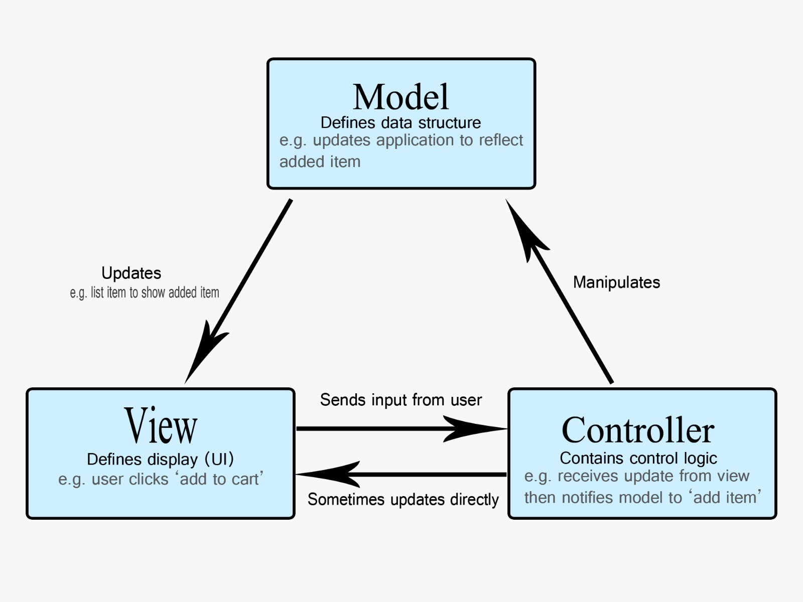

# praktikum-web-mvc
IMPLEMENTASI ARSITEKTUR MVC UNTUK MANAJEMEN DATA ITEM

## Tujuan Proyek

Proyek ini adalah demonstrasi dan studi kasus implementasi arsitektur **Model-View-Controller (MVC)** dalam lingkungan **Node.js/Express.js**.

Fokus utama proyek ini adalah membangun sistem **CRUD** yang terstruktur untuk manajemen inventaris **Koleksi Item Fashion Wanita**, menunjukkan integrasi penuh antara *backend* yang menggunakan **Sequelize ORM** dan *frontend* yang dinamis (EJS).

---

## Arsitektur Proyek (MVC & ORM)

Menerapkan arsitektur **Model-View-Controller (MVC)** untuk memisahkan *business logic* dari tampilan data, serta menggunakan **Sequelize ORM** untuk interaksi dengan *database*.

### Pembagian Tugas Komponen:

| Komponen | File Utama | Peran |
| :--- | :--- | :--- |
| **Controller (C)** | `app.js` | Mengatur *routing*, menangani *request* HTTP, dan mengontrol alur data antara Model dan View. |
| **Model (M)** | `models/Item.js` | Menghubungkan dan mendefinisikan struktur tabel `items` di MySQL (ORM). |
| **View (V)** | `views/index.ejs` | Menampilkan data item secara dinamis menggunakan *template engine* EJS. |




### Struktur File Utama:

```bash
.
├── app.js             # ⬅️ Controller Utama & Routing
├── package.json       # ⬅️ Daftar Dependensi (Wajib untuk npm install)
├── models/
│   ├── connection.js  # Konfigurasi Koneksi Database
│   └── Item.js        # Definisi Model Item
└── views/
    └── index.ejs      # ⬅️ View Utama (Tampilan Tabel Data)
